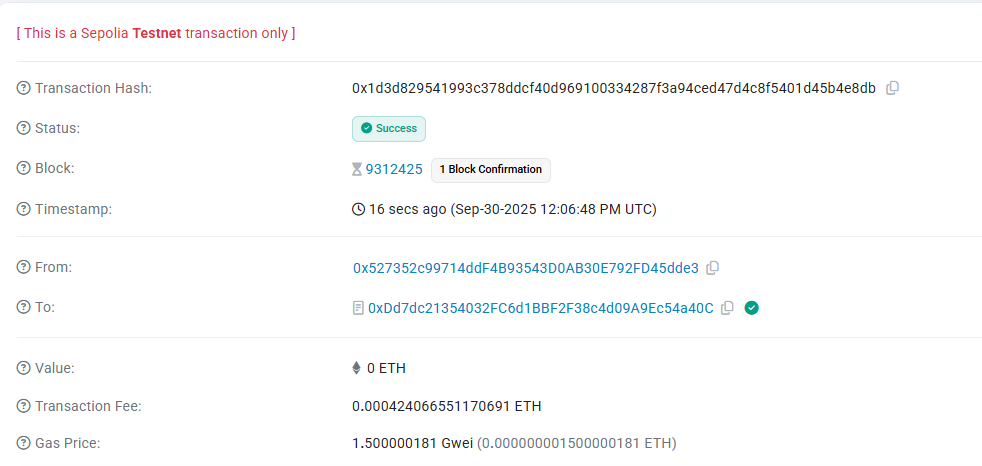

# 🏢 Privacy Building Certification

> Confidential Green Building Assessment & Energy Efficiency Certification using Fully Homomorphic Encryption (FHE)

[](https://privacy-building-certification-w9b7.vercel.app/)
[](https://sepolia.etherscan.io/address/0xDd7dc21354032FC6d1BBF2F38c4d09A9Ec54a40C)
[](LICENSE)

## 🌟 Overview

Privacy Building Certification is a decentralized application that enables **confidential green building assessments** while maintaining complete data privacy. Using Zama's Fully Homomorphic Encryption (FHE) technology, building owners can submit sensitive energy consumption and efficiency data for certification without revealing actual values to anyone - not even the certifying authority.

### 🎯 Core Concept

Traditional green building certifications require building owners to disclose sensitive operational data including:
- Actual energy consumption figures
- Efficiency ratings
- Carbon footprint metrics
- Operational costs

This disclosure can expose competitive advantages and business intelligence to competitors. Our solution uses **Fully Homomorphic Encryption (FHE)** to perform calculations on encrypted data, ensuring:

✅ **Complete Privacy** - Data remains encrypted on-chain
✅ **Verifiable Computation** - Certification scores computed on encrypted values
✅ **Transparent Process** - Smart contract logic is public and auditable
✅ **Regulatory Compliance** - Meets data privacy requirements

## 🔐 FHE Technology

### What is Fully Homomorphic Encryption?

FHE allows computations to be performed directly on encrypted data without decryption. This means:

```
Encrypted(a) + Encrypted(b) = Encrypted(a + b)
Encrypted(a) × Encrypted(b) = Encrypted(a × b)
```

### Why FHE for Building Certification?

**Traditional Approach:**
```
Building Owner → Submit Plain Data → Authority Sees Everything → Score
```

**FHE Approach:**
```
Building Owner → Submit Encrypted Data → Authority Cannot See Data → Compute on Encrypted Data → Reveal Only Final Score
```

### Privacy Benefits

- 🔒 **Energy Consumption** - Encrypted, reveals no production scale
- 🔒 **Efficiency Ratings** - Encrypted, protects competitive advantage
- 🔒 **Carbon Footprint** - Encrypted, prevents brand damage
- ✅ **Final Certification** - Only the result is revealed

## 📋 Smart Contract

### Contract Address

**Sepolia Testnet:**
```
0xDd7dc21354032FC6d1BBF2F38c4d09A9Ec54a40C
```

[View on Etherscan →](https://sepolia.etherscan.io/address/0xDd7dc21354032FC6d1BBF2F38c4d09A9Ec54a40C)

### Key Features

#### 1. Encrypted Data Submission
```solidity
function submitBuilding(uint32 _energy, uint8 _efficiency) external {
    euint32 encryptedEnergy = FHE.asEuint32(_energy);
    euint8 encryptedEfficiency = FHE.asEuint8(_efficiency);
    // Data stored encrypted on-chain
}
```

#### 2. Homomorphic Computation
```solidity
function calculateScore(uint256 id) external {
    // Compute on encrypted data
    euint32 totalScore = FHE.mul(
        FHE.asEuint32(buildings[id].efficiency),
        FHE.asEuint32(10)
    );
    // Request async decryption for final score only
}
```

#### 3. Access Control
```solidity
// Only authorized parties can decrypt
FHE.allowThis(encryptedData);
FHE.allow(encryptedData, msg.sender);
```

### Certification Levels

| Level | Score | Description |
|-------|-------|-------------|
| 🥉 Bronze | 100+ | Basic energy efficiency |
| 🥈 Silver | 200+ | Good energy performance |
| 🥇 Gold | 350+ | Excellent efficiency |
| 💎 Platinum | 500+ | Outstanding green building |

## 🎬 Demo Video



**Watch Full Demo:**
`PrivacyBuildingCertification.mp4` - Demonstrates the complete workflow from wallet connection to building submission and certification.

### Demo Highlights

- ✅ Connect wallet to Sepolia testnet
- ✅ Submit encrypted building data
- ✅ View encrypted on-chain storage
- ✅ Authority verification process
- ✅ Score calculation on encrypted data
- ✅ Final certification reveal

## 📸 On-Chain Transaction Examples

### Building Submission Transaction
When submitting building data, all sensitive information is encrypted before being stored on-chain:


**Example Transaction:**
- Building data encrypted with FHE
- Energy consumption: `ENCRYPTED`
- Efficiency rating: `ENCRYPTED`
- Only building ID and owner address visible

### Key Transaction Types

1. **submitBuilding** - Submit encrypted building data
2. **verifyBuilding** - Certification authority verification
3. **calculateScore** - Trigger score computation on encrypted data
4. **processScore** - Callback with decrypted final score

## 🚀 Live Application

**🌐 Access the app:** [https://privacy-building-certification-w9b7.vercel.app/](https://privacy-building-certification-w9b7.vercel.app/)

### How to Use

#### Step 1: Connect Wallet
- Install MetaMask
- Switch to Sepolia testnet
- Click "Connect Wallet"

#### Step 2: Submit Building Data
- Fill in building information
- Enter energy consumption (kWh/year)
- Provide efficiency ratings (0-10 scale)
- Submit - data is automatically encrypted

#### Step 3: Await Verification
- Certification authority reviews submission
- Verification is recorded on-chain
- No sensitive data is exposed

#### Step 4: Get Certification
- Score calculated on encrypted data
- Final score revealed through secure decryption
- Certification level assigned

## 🏗️ Architecture

### Technology Stack

- **Smart Contracts**: Solidity 0.8.24
- **FHE Library**: @fhevm/solidity v0.7.0
- **Network**: Ethereum Sepolia Testnet
- **Frontend**: Vanilla JavaScript + Ethers.js v6
- **Encryption**: Zama fhEVM

### System Architecture

```
┌─────────────────┐
│  Building Owner │
└────────┬────────┘
         │ Submit encrypted data
         ▼
┌─────────────────────────┐
│  Smart Contract (FHE)   │
│  - Encrypted Storage    │
│  - Homomorphic Compute  │
└────────┬────────────────┘
         │ Verification request
         ▼
┌─────────────────────────┐
│ Certification Authority │
│  - Cannot see raw data  │
│  - Can verify building  │
└────────┬────────────────┘
         │ Approve
         ▼
┌─────────────────────────┐
│   Score Calculation     │
│  - Computed on FHE data │
│  - Only result revealed │
└─────────────────────────┘
```

## 🌍 Use Cases

### 1. Corporate Sustainability Reporting
- Companies can certify buildings without exposing proprietary operational data
- Competitive advantage maintained
- Regulatory compliance achieved

### 2. Real Estate Valuation
- Building efficiency certified independently
- Sensitive operational metrics protected
- Trust established through blockchain transparency

### 3. Government Incentive Programs
- Buildings qualify for green incentives
- Data privacy preserved
- Fraud prevention through immutable records

### 4. International Certifications
- Cross-border certifications without data transfer concerns
- GDPR and privacy law compliance
- Universal standards verification

## 🔬 Technical Innovation

### FHE Implementation Details

#### Encrypted Types
```solidity
euint32 energy;      // 32-bit encrypted unsigned integer
euint8 efficiency;   // 8-bit encrypted unsigned integer
```

#### Supported Operations
- ✅ Addition: `FHE.add(a, b)`
- ✅ Subtraction: `FHE.sub(a, b)`
- ✅ Multiplication: `FHE.mul(a, b)`
- ✅ Comparison: `FHE.lt(a, b)`, `FHE.gt(a, b)`

#### Async Decryption Flow
```solidity
// 1. Request decryption
FHE.requestDecryption(cts, callback);

// 2. KMS verifies and signs
// 3. Callback processes result
function processScore(
    uint256 requestId,
    uint32 _score,
    bytes[] memory signatures
) external {
    FHE.checkSignatures(requestId, signatures);
    // Use decrypted score
}
```

## 📊 Comparison: Traditional vs FHE Approach

| Aspect | Traditional | FHE Approach |
|--------|------------|--------------|
| **Data Storage** | Plain text | Encrypted |
| **Computation** | On plain data | On encrypted data |
| **Privacy** | None | Complete |
| **Verification** | Manual review | Smart contract |
| **Trust Model** | Trust authority | Trust math |
| **Auditability** | Limited | Full blockchain history |
| **Compliance** | Challenging | Built-in |

## 🎓 Educational Resources

### Understanding FHE

- **Zama Documentation**: [docs.zama.ai](https://docs.zama.ai/)
- **fhEVM GitHub**: [github.com/zama-ai/fhevm](https://github.com/zama-ai/fhevm)
- **Encrypted Computation**: Learn how math works on ciphertext

### Smart Contract Security

- Contract inherits `SepoliaConfig` for proper FHE setup
- Access control modifiers protect sensitive functions
- Async decryption prevents timing attacks
- KMS signature verification ensures result authenticity

## 🌐 Links

- **Live Application**: [https://privacy-building-certification-w9b7.vercel.app/](https://privacy-building-certification-w9b7.vercel.app/)
- **GitHub Repository**: [https://github.com/TitoJohnston/PrivacyBuildingCertification](https://github.com/TitoJohnston/PrivacyBuildingCertification)
- **Smart Contract**: [0xDd7dc21354032FC6d1BBF2F38c4d09A9Ec54a40C](https://sepolia.etherscan.io/address/0xDd7dc21354032FC6d1BBF2F38c4d09A9Ec54a40C)
- **Zama fhEVM**: [https://github.com/zama-ai/fhevm](https://github.com/zama-ai/fhevm)

## 🤝 Contributing

Contributions are welcome! This project demonstrates the potential of FHE in real-world applications. Areas for contribution:

- Additional certification metrics
- Enhanced privacy features
- Multi-language support
- Mobile optimization
- Integration with IoT sensors

## 📄 License

This project is licensed under the MIT License - see the LICENSE file for details.

## 🙏 Acknowledgments

- **Zama** for pioneering FHE technology in blockchain
- **Ethereum Foundation** for Sepolia testnet infrastructure
- **Open source community** for continuous innovation

## ⚠️ Disclaimer

This is a demonstration project on Sepolia testnet. For production use:
- Conduct thorough security audits
- Test extensively with real-world data
- Ensure proper key management
- Verify regulatory compliance in your jurisdiction

---

**Built with privacy in mind. Powered by FHE. 🔐**

*Making green building certification accessible while preserving confidential business data.*